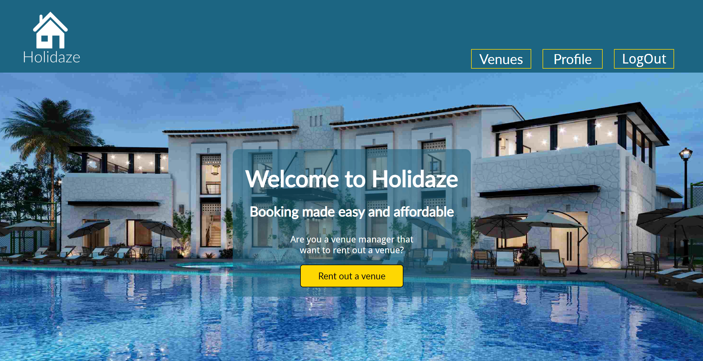

# Exam 2 (Holidaze)

## Description

This project is a website built for a fictional booking site called Holidaze and is a school exam. The site is responsive down to at least 270px and is built with a mobile-first approach using React, HTML, CSS modules, CSS, and JS. The site consists of six pages: the landing page, the login page, a sign-up page, a venue-specific page, a profile page, and a 404 page (not found page).
The site has a header that consists of a logo and navigation elements. For mobile, the header has a hamburger menu, and for desktop, the header has traditional navigation elements. The header changes depending on whether the user is logged in or not. If the user is not logged in, the navigation elements consist of Venues, Login, and Signup. If the user is logged in, the elements consist of Venues, Profile, and Logout.
The footer consists of a section with contact information and navigation elements that also change depending on the user's logged-in status. If the user is logged in, the navigation elements consist of Home and Profile. If the user is not logged in, the navigation elements consist of Home, Login, and Signup.
The user first accesses the landing page, this page consists of two sections the welcome section and a venue section, the venue section fetches all venues from the API and displays them to the user 12 venues at the time, the venue section also has a search bar and a filter section, where users can use different filter settings to filter the venues. The user can then either go to the login page, a specific page, or the sign-up page, the specific page includes information about the venue and venue manager, it also has two links to the login page if the user is not logged in and links to venue manager profile and a booking form if the user is logged in, the login page consists of a login form and a link to the sign-up page, the sign-up page consists of a signup form and a link to the login page, the sign-up form has the opportunity for both customers and venue managers to register a user, all forms on the site uses yup form control to validate the user input. The next page a user will access is the profile page. The profile page has three different layouts depending on whether the user is a venue manager, a customer, or viewing another manager's profile. The last page is the 404 page not found page, this page is accessed if a user tries to go to a page that doesn’t exist, in this case, the 404 page is rendered instead, and a message is shown to the user which tells them that the page doesn’t exist.

## Pages

### Landing page

The landing page consists of two sections. The first section has an image and a welcome heading with a link to the profile page if the user is logged in. If they are not logged in, the link goes to the login page. The next section is the venue section, where all the venues are fetched and displayed. If a user presses the "Load More" button, the next 12 venues are loaded. This section also has a filter section that allows users to apply different filter settings. These settings include various inclusions such as pets allowed, breakfast included, Wi-Fi included, and parking included. Users can also filter based on the number of guests allowed in the venue. The landing page also includes a look-ahead search bar.

### Login page

The login page consists of a login form and a link to the signup page for users who are not already customers or venue managers. The form has two input fields: email and password. The inputs use Yup for form control. The password needs to be at least 8 characters long, and the email must be a @stud.noroff.no email account.

### Sign-up page

The signup page consists of an image to the right and a signup form on the left for desktop. On mobile, the image is on top of the form. The form has five text inputs validated by Yup for form control, and one radio input where users can select between the user type of customer or venue manager.

### Specific page

The specific page consists of several sections. The first section is the image carousel, which displays all images that the venue has. The next section contains the venue information and the venue manager information. This section also has a link for logged-in users to view the venue manager's profile. If the user is not logged in, it changes to a link to the login page. The last section is the booking section. This section has a booking form where users can book dates for that specific venue. The inputs are validated so that check-out cannot be before check-in. Dates that are already booked, along with the dates in between, are also faded out and unclickable, so users know which dates are available and unavailable. If the user is not logged in, the booking section changes to an informational text telling the user that they need to log in to book venues and provides a link to the login page. If the venue belongs to the user, the text informs the user that they cannot book their own venues, and the link changes to the landing page.

### Profile page

The profile page has three different layouts depending on who is accessing it and how. The first layout is the customer profile page. This page consists of a user info section, which includes the profile picture and a button to change the avatar picture. If a user presses the change avatar button, a single input appears where users can add a new avatar picture link. If the API rejects the link, the user gets an error message; otherwise, the profile section reloads, and the new picture appears. The profile picture also has a backup picture in case something goes wrong or the picture can't be displayed. The next section for the customer profile is the "My Bookings" section, which displays the bookings associated with that profile. The "My Bookings" cards have information about the bookings and a cancel reservation button. If the cancel reservation button is clicked, a "Are you sure?" overlay appears, and the user has two choices: either press "Go Back" or "Cancel Reservation." The second layout is the venue manager profile page, which serves as the profile page or "admin page" for venue managers. The first section on the page is the same as the customer profile page, but the next section acts more like an admin panel with four buttons, each showing a different section. The first button, "Bookings on My Venues," shows the bookings on the user's own venues. The next button, "My Venues," shows the user-published venues as venue cards. These cards include an edit button that opens an edit form, allowing the user to edit or delete their venue. The "Rent Out a Venue" button opens the rent-out venue form, which is almost identical to the edit form but doesn’t have any inputs filled out. Both the edit and rent-out forms use Yup for form control to validate the inputs. The final button, "My Bookings," shows the same booking cards as the customer profile page in case a venue manager has booked a venue. The third layout is for users who have clicked on another venue manager to view their profile. The first section is almost identical to the customer info section, with the only difference being the absence of the change avatar button. The next section showcases the venue manager's active venues as venue cards.

## Design

- Colors: The primary colors used are off-white (#ECECEC) for most background areas, except in text-heavy sections where white (#FFFFFF) is used with black (#000000) as the text color. Light-blue (#1C6582) is used for the header, footer, and some backgrounds. The secondary colors include sunny yellow (#E6CC00) for buttons and links, black (#000000) for text, red (#C00000) and light-red (#FFCCCC) for error messages, and light green (#AAE4C0) and dark green (#28804A) for success messages.
- Typography: For headings,buttons and links is Lato used. for body text Droid sans is used.
- grid: On most of the site, CSS Flex is used. For mobile, a single-column grid is implemented, which gradually increases to more columns until a set max width is reached. In some places, such as the venue section on the landing page for desktop, CSS Grid is used.

## Functionality

- Users can register to the API
- Users can log in
- Header and footer changes when logged in
- Users can search for a venue name or location
- Users can filter venues based on different filter settings managed by global states using a Zustand store.
- The specific page is dynamically built and accessed by users clicking on a venue card
- Yup for form control and validation on all inputs
- Booking functionality
- Dynamically built profile page for venue managers, including an admin panel
- The profile page for customers is dynamically built and includes a section to view upcoming bookings.
- Dynamically built profile page for viewing other venue managers including a section to view theire venues
- Functionality for users to change avatar
- Functionality for users to delete their upcoming bookings
- Functionality for venue managers to publish venues
- Functionality for venue managers to edit their venues
- Functionality for venue managers to delete their venues
- Functionality for venue managers to see their venues
- Functionality for venue managers to view bookings on their venues
- Functionality for users to sort venues by: Newest venue first, Oldest venue first, Lowest price first, Highest price first, Lowest rating first, Highest rating first
- Hamburger menu for mobile users
- Logout functionality
- Loading spinner on every section that recives data from the API

## Built with

- React
- JS
- CSS modules
- CSS
- HTML
- Noroff Holidaze API
- Zustand state management
- Yup is a schema builder

## Requirements

### For development

- Code editor (Visual Studio Code is recomended)
- Node.js latest version is recomended
- NPM(Node Package Manager)

### For users

- Web Browser

### Installation for local development

- Clone repository from Github
- Open the repository with Visual Studio Code or another code editor
- Install dependencies using:
  `npm install`
- Open live server with:
  `npm start`

## Available Scripts

In the project directory, you can run:

### `npm start`

Runs the app in the development mode.\
Open [http://localhost:3000](http://localhost:3000) to view it in your browser.

The page will reload when you make changes.\
You may also see any lint errors in the console.

### `npm run build`

Builds the app for production to the `build` folder.\
It correctly bundles React in production mode and optimizes the build for the best performance.

The build is minified and the filenames include the hashes.\
Your app is ready to be deployed!

See the section about [deployment](https://facebook.github.io/create-react-app/docs/deployment) for more information.

### `npm run eject`

**Note: this is a one-way operation. Once you `eject`, you can't go back!**

If you aren't satisfied with the build tool and configuration choices, you can `eject` at any time. This command will remove the single build dependency from your project.

Instead, it will copy all the configuration files and the transitive dependencies (webpack, Babel, ESLint, etc) right into your project so you have full control over them. All of the commands except `eject` will still work, but they will point to the copied scripts so you can tweak them. At this point you're on your own.

You don't have to ever use `eject`. The curated feature set is suitable for small and middle deployments, and you shouldn't feel obligated to use this feature. However we understand that this tool wouldn't be useful if you couldn't customize it when you are ready for it.

## Running

https://holidazzze.netlify.app/

## Contact

My email address: mathiasgausl@gmail.com
